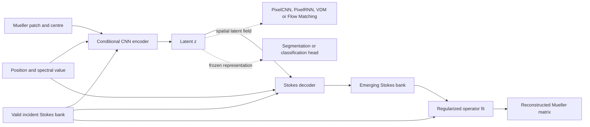

# Stokes-Aware Mueller Generator (SAMG)

SAMG is a research implementation for learning compact representations of
Mueller matrices through their action on incident Stokes states. The central
path is

\[
(M, S_{\mathrm{in}}) \longrightarrow z \longrightarrow
\widehat S_{\mathrm{out}} \longrightarrow \widehat M.
\]

The repository contains a clean, installable extraction of the architectures
used in the accompanying research workspace. It intentionally excludes source
datasets, patient or specimen identifiers, trained weights, caches and report
build artefacts.

## What is included

- `ConditionalCNNPIVAE` and `FourIncidentPIVAE`: the historical
  Stokes-conditioned SAMG architecture;
- `OperatorPIVAE`: a per-observation tetrahedral-bank variant whose encoder is
  independent of the incident probe;
- `DirectMuellerVAE`: the direct sixteen-coefficient VAE baseline;
- differentiable Stokes application, ridge reconstruction and Cloude
  transforms, metrics and PSD projection;
- PixelCNN, PixelRNN, latent VDM and Flow Matching priors for spatial latent
  fields;
- lightweight shared heads for segmentation and classification;
- a train-only/validation-only training command, a separate evaluation
  command and a fully synthetic smoke dataset;
- unit tests and release-safety checks suitable for continuous integration.

No Cloude-Cholesky architecture is included: the public comparison here is
deliberately restricted to SAMG and its direct VAE baseline.

## Architecture



The model exposes three distinct objects: latent coordinates `z`, decoded
Stokes actions and the Mueller operator fitted from those actions. Validity of
the finite decoded rays does not by itself imply global Cloude-PSD
realizability, so the two properties are evaluated separately.

## Installation

Create an environment with the PyTorch build appropriate for your CPU or GPU,
then install the package:

```bash
python -m venv .venv
python -m pip install --upgrade pip
python -m pip install -e ".[dev]"
```

The code is tested with Python 3.11 and PyTorch 2.4 on CPU. CUDA is optional.

## Thirty-second smoke test

```bash
python examples/quickstart.py
pytest
```

To exercise the complete data contract without private data:

```bash
samg-make-synthetic --output data/synthetic --train-size 256 --validation-size 64
samg-train --model samg --train data/synthetic/train.pt \
  --validation data/synthetic/validation.pt --output runs/smoke --epochs 3 --device cpu
samg-evaluate --model samg --checkpoint runs/smoke/best_mse.pt \
  --data data/synthetic/validation.pt --output runs/smoke/evaluation.json \
  --device cpu --include-psd-projection
```

Runtime outputs are ignored by Git.

## Using the models

```python
import torch
from samg.models import DirectMuellerVAE, FourIncidentPIVAE

batch = 4
patch = torch.randn(batch, 16, 5, 5)
matrix = patch[:, :, 2, 2].reshape(batch, 4, 4)
position = torch.rand(batch, 2)
spectral = torch.rand(batch, 1)

samg = FourIncidentPIVAE(latent_dim=8).eval()
direct = DirectMuellerVAE(latent_dim=8).eval()

with torch.no_grad():
    samg_output = samg(patch, matrix, position, spectral)
    direct_output = direct(patch, matrix, position, spectral)

print(samg_output["m_hat"].shape, direct_output["m_hat"].shape)
```

## Reproducibility contract

The training command never opens a test split. Model selection uses validation
data only; test evaluation is an explicit, separate command. Biological-unit
identifiers must be disjoint across splits and normalization statistics must be
fitted on training data only. See [the data contract](docs/data.md) and
[the reproducibility guide](docs/reproducibility.md).

Existing private research checkpoints require the exact matching class and
preprocessing convention; see [the compatibility note](docs/compatibility.md).

Latent-field priors use their own leakage-safe split contract. Once train and
validation latent tensors have been exported, a family can be trained and
sampled with:

```bash
samg-train-generator --family flow --train data/latent_train.pt \
  --validation data/latent_validation.pt --output runs/flow
samg-sample-generator --checkpoint runs/flow/best.pt \
  --output outputs/flow_samples.pt --count 16
```

The synthetic example verifies software execution, not scientific performance.
Numerical claims require the original non-redistributable datasets and the
corresponding frozen protocol.

## Project status

This is a research release, not a clinical device. The API is versioned but may
change before `1.0`. See [the model card](docs/model_card.md) for intended use,
assumptions and limitations.

## Citation and licence

Citation metadata are provided in [`CITATION.cff`](CITATION.cff). The code is
released under the MIT licence. Dataset and checkpoint licences are separate
and are not granted by this repository.
