# Stokes-Aware Mueller Generator (SAMG)

SAMG is a physics-aware generative framework for Mueller polarimetry. It learns
a compact latent representation from measured Mueller matrices, predicts their
action on incident Stokes states, and reconstructs the corresponding optical
operator:

$$
(M, S_{\mathrm{in}}) \longrightarrow z \longrightarrow
\widehat S_{\mathrm{out}} \longrightarrow \widehat M.
$$

> **Code-only research release.** This repository contains architectures,
> physics operators, training code, tests and fixed scientific figures. It does
> **not** contain trained weights, private datasets, patient identifiers, caches
> or latent tensors.

## What SAMG produces

- compact latent maps for heterogeneous polarimetric sources;
- Mueller reconstructions through decoded Stokes responses;
- complete generated Mueller fields with 16 spatial coefficient maps;
- explicit responses to user-specified incident Stokes states;
- conditional field–mask pairs for data augmentation;
- frozen or fine-tuned representations for segmentation and classification.

## Main verified results

The values below come from fixed archived campaigns. Rows correspond to
different tasks and should not be read as a cross-task leaderboard.

| Evaluation | Protocol | Result |
|---|---|---|
| Matched SAMG vs direct VAE | 4,384 matrices, 54 biological units, 5 matched seeds | Cloude-PSD fraction: **52.65 ± 2.51%** for SAMG vs **34.13 ± 1.79%** for the direct VAE (**+18.52 points**). Normalized MSE: 0.4056 ± 0.0256 vs 0.3975 ± 0.0289. |
| Complete generated fields | Every pixel of 16–32 archived samples per family; strict criterion $\lambda_{\min}(H) \geq 0.005$ | **96.22%** PixelCNN, **100.00%** PixelRNN, **99.999%** latent VDM and **99.96%** Flow Matching. The autoregressive and continuous families use different corpora and resolutions, so these rates are descriptive rather than a ranking. |
| ColoPola augmentation at 5% labels | Root-grouped test split, 46 roots / 113 acquisitions, 30 paired seeds | AUC **0.847 ± 0.103** with Flow Matching augmentation vs **0.840 ± 0.115** without augmentation. |
| Cervical multiclass segmentation | 43 training and 11 internal-validation acquisitions, 3 retained seeds | Patient-mean macro-Dice excluding background: **0.6076** with Flow Matching augmentation vs **0.5977** with real data only (**+0.99 point**). |

<p align="center">
  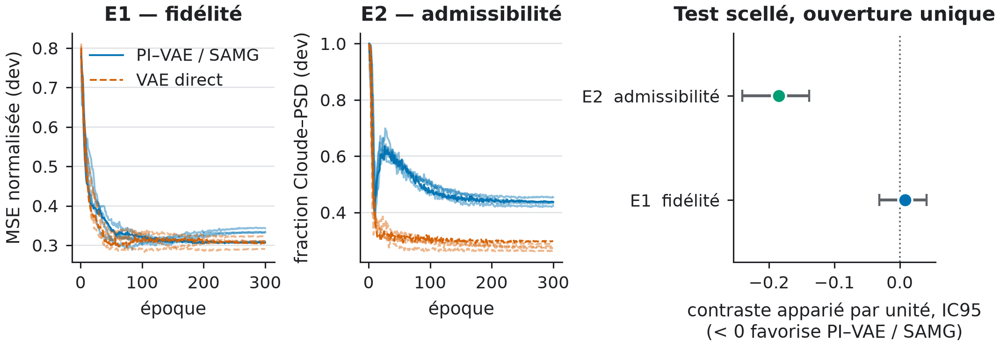
</p>

The matched experiment uses the same data, latent dimension, optimization
budget and seeds for SAMG and the direct VAE. Fidelity and physical
admissibility are reported together because neither metric substitutes for the
other.

## Selected model outputs

### Five-source corpus summary

<p align="center">
  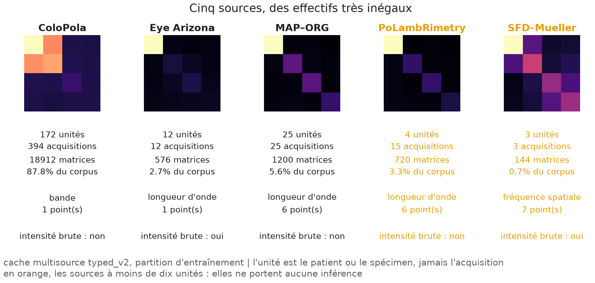
</p>

The five sources contain different numbers of biological units, acquisitions
and spectral conditions. The displayed matrices are aggregate absolute Mueller
signatures, not individual images.

### Spatial structure of the unified latent field

<p align="center">
  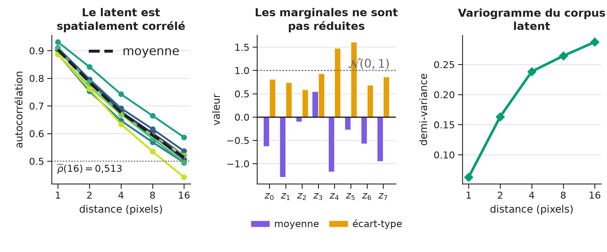
</p>

The eight latent channels remain spatially correlated, have different
marginal scales and exhibit a growing variogram. These measured properties
motivate spatial generators instead of independent latent-pixel sampling.

### Operator reconstruction at one held-out location

<p align="center">
  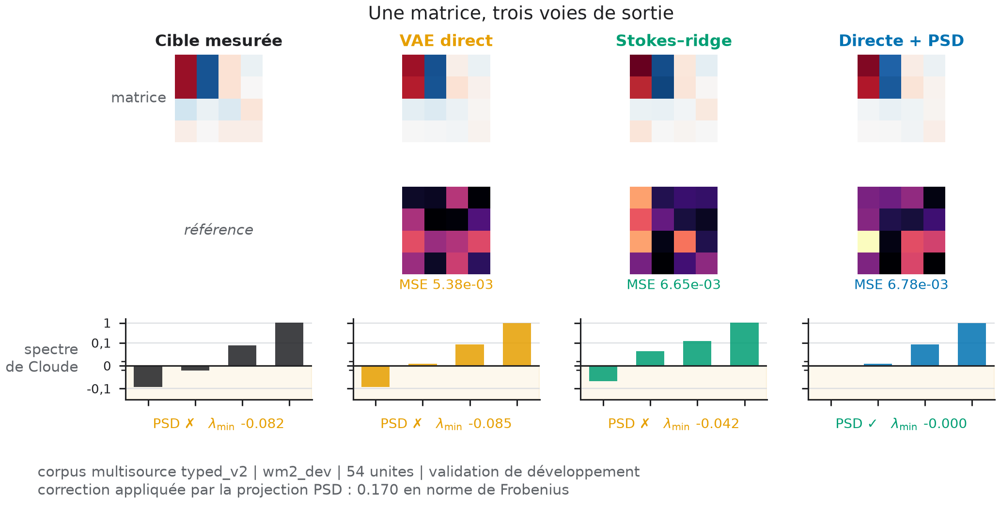
</p>

The target, predictions, matrix errors and Cloude spectra are shown together.
The post-hoc PSD arm illustrates the fidelity–admissibility trade-off without
changing the trained direct VAE.

### Spatial signatures of the four generators

<p align="center">
  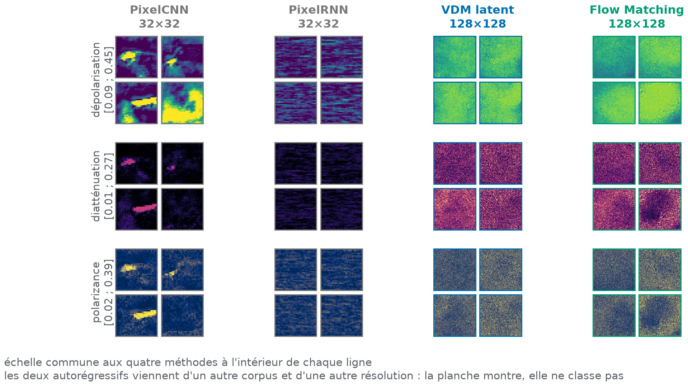
</p>

Each physical quantity uses one common scale across the four methods. PixelCNN
and PixelRNN produce 32×32 fields, whereas latent VDM and Flow Matching produce
128×128 fields from a separate campaign; the panel compares generated
signatures rather than ranking methods.

### Complete Mueller-field generation

<p align="center">
  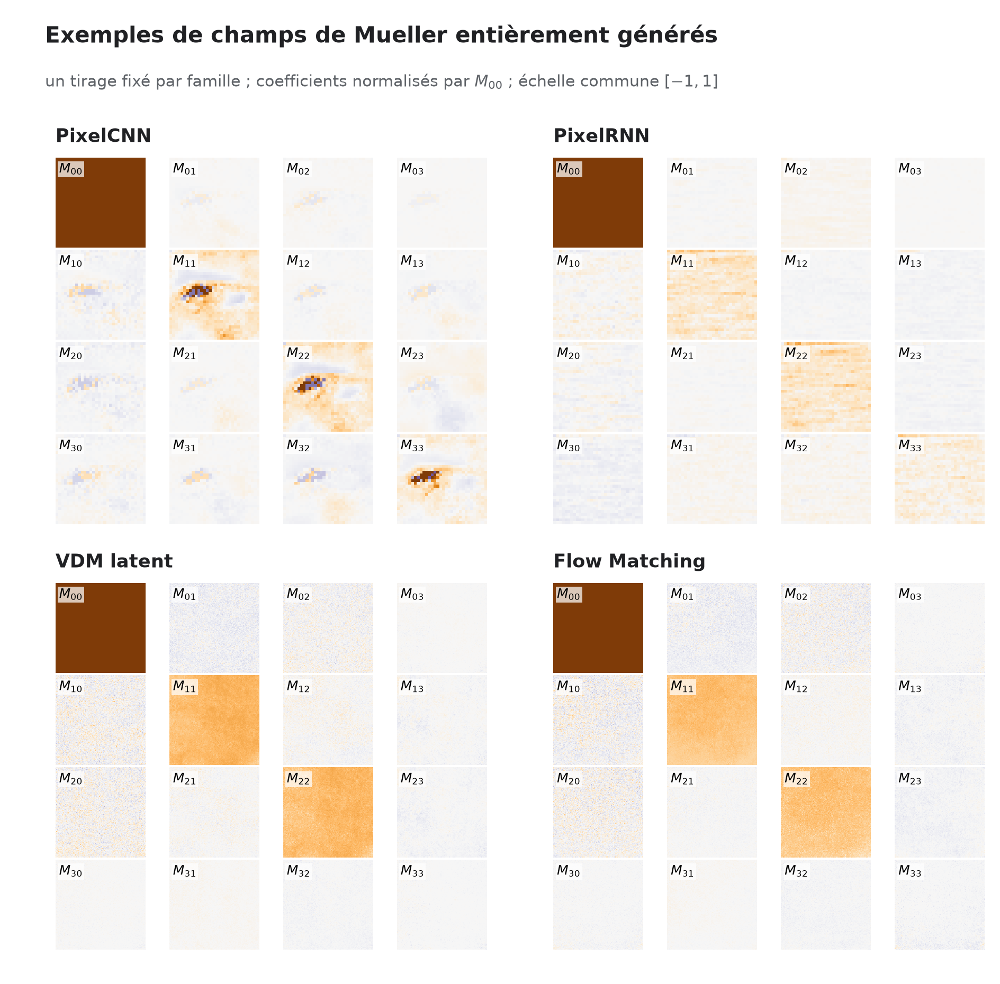
</p>

Each block is one fully generated Mueller field normalized by $M_{00}$. The 16
coefficient maps are decoded with the same physical convention used during
evaluation.

### Stokes interrogation of a generated operator

<p align="center">
  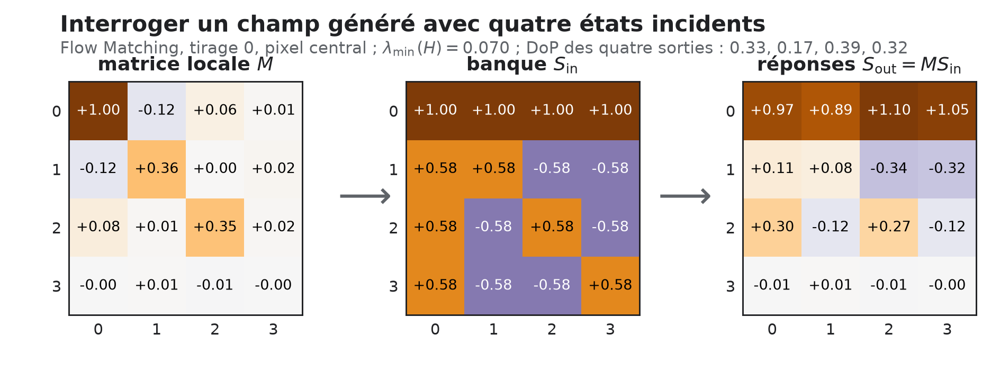
</p>

This is the central interface exposed by SAMG: a generated local operator is
queried with four admissible incident states and returns the corresponding
emerging states. The displayed responses are obtained by the deterministic
product $S_{\mathrm{out}} = M S_{\mathrm{in}}$.

### Synthetic cervical field–mask pair

<table>
  <tr>
    <th>Generated depolarization channel</th>
    <th>Generated multiclass mask</th>
  </tr>
  <tr>
    <td>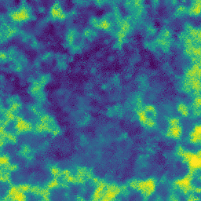</td>
    <td>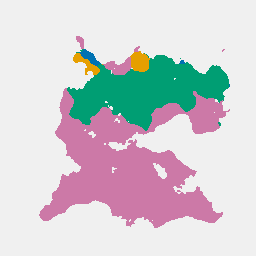</td>
  </tr>
</table>

The pair is produced by mask-conditioned Flow Matching using training data
only. Its decoded pseudo-Mueller field is projected with a Cloude margin of
0.005 and normalized to $M_{00}=1$.

### Data augmentation across label budgets

<p align="center">
  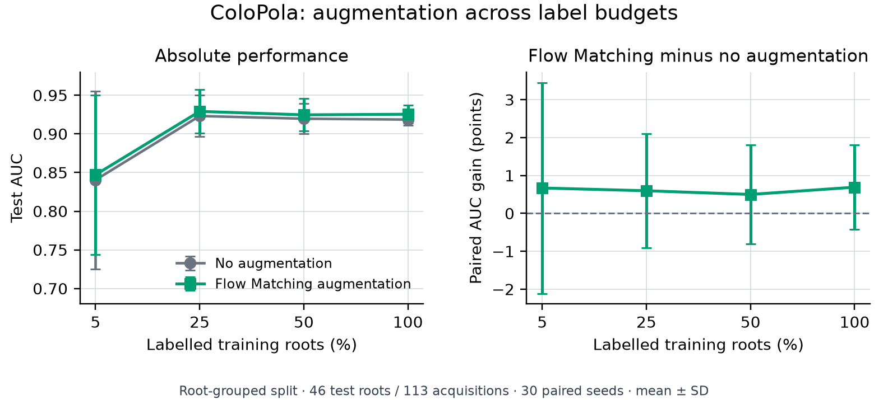
</p>

The classifier, optimization budget and grouped split are identical in both
arms; only the generated augmentation changes. The 1% regime is intentionally
not included because too few labelled roots make it qualitatively different
from the remaining budgets.

Human-image reconstruction and cervical segmentation plates are intentionally
not redistributed here while the source-dataset permissions are being checked.
The numerical aggregate results remain reported above; no individual image or
identifier is required to obtain them.

Machine-readable values are provided in
[`docs/results/selected_results.json`](docs/results/selected_results.json), and
the figure inventory is documented in
[`docs/assets/README.md`](docs/assets/README.md).

## Included architectures

- `ConditionalCNNPIVAE` and `FourIncidentPIVAE`: the historical
  Stokes-conditioned SAMG architecture;
- `OperatorPIVAE`: a tetrahedral-bank variant whose encoder is independent of
  the incident probe;
- `DirectMuellerVAE`: the direct 16-coefficient VAE baseline;
- PixelCNN, PixelRNN, latent VDM and Flow Matching priors for spatial latent
  fields;
- lightweight shared heads for segmentation and classification;
- differentiable Stokes application, ridge reconstruction, Cloude transforms,
  strict-PSD metrics and PSD projection.

No Cloude-Cholesky architecture is included. The public comparison is
deliberately restricted to SAMG and its direct VAE baseline.

## Architecture

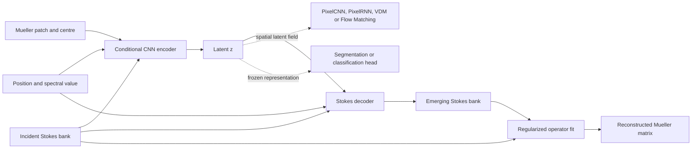

The implementation distinguishes latent coordinates `z`, decoded Stokes
actions and the Mueller operator fitted from those actions. Validity of a
finite set of decoded rays does not by itself imply global Cloude-PSD
realizability, so both properties are evaluated separately.

## Installation

Create an environment with the PyTorch build appropriate for your CPU or GPU,
then install the package:

```bash
python -m venv .venv
python -m pip install --upgrade pip
python -m pip install -e ".[dev]"
```

The code is tested with Python 3.11 and PyTorch 2.4 on CPU. CUDA is optional.

## Thirty-second smoke test

```bash
python examples/quickstart.py
pytest
```

To exercise the complete data contract without private data:

```bash
samg-make-synthetic --output data/synthetic --train-size 256 --validation-size 64
samg-train --model samg --train data/synthetic/train.pt \
  --validation data/synthetic/validation.pt --output runs/smoke --epochs 3 --device cpu
samg-evaluate --model samg --checkpoint runs/smoke/best_mse.pt \
  --data data/synthetic/validation.pt --output runs/smoke/evaluation.json \
  --device cpu --include-psd-projection
```

Runtime outputs are ignored by Git.

## Using the models

```python
import torch
from samg.models import DirectMuellerVAE, FourIncidentPIVAE

batch = 4
patch = torch.randn(batch, 16, 5, 5)
matrix = patch[:, :, 2, 2].reshape(batch, 4, 4)
position = torch.rand(batch, 2)
spectral = torch.rand(batch, 1)

samg = FourIncidentPIVAE(latent_dim=8).eval()
direct = DirectMuellerVAE(latent_dim=8).eval()

with torch.no_grad():
    samg_output = samg(patch, matrix, position, spectral)
    direct_output = direct(patch, matrix, position, spectral)

print(samg_output["m_hat"].shape, direct_output["m_hat"].shape)
```

## Training a spatial prior

Once leakage-safe train and validation latent tensors have been exported, a
generator can be trained and sampled with:

```bash
samg-train-generator --family flow --train data/latent_train.pt \
  --validation data/latent_validation.pt --output runs/flow
samg-sample-generator --checkpoint runs/flow/best.pt \
  --output outputs/flow_samples.pt --count 16
```

## Reproducibility and data contract

The training command never opens a test split. Model selection uses validation
data only; test evaluation is a separate command. Biological-unit identifiers
must be disjoint across splits, and normalization statistics must be fitted on
training data only. See [the data contract](docs/data.md) and
[the reproducibility guide](docs/reproducibility.md).

The synthetic example verifies software execution, not scientific performance.
Reproducing the reported numerical values requires access to the original
non-redistributable datasets and separately licensed checkpoints. Existing
private checkpoints require the exact matching class and preprocessing
convention described in [the compatibility note](docs/compatibility.md).

## Project status

This is a research release, not a clinical device. The API is versioned but may
change before `1.0`. See [the model card](docs/model_card.md) for intended use,
assumptions and limitations.

## Citation and licence

Citation metadata are provided in [`CITATION.cff`](CITATION.cff). The source
code is released under the MIT licence. Dataset, measured-image and checkpoint
licences remain separate and are not granted by this repository.
